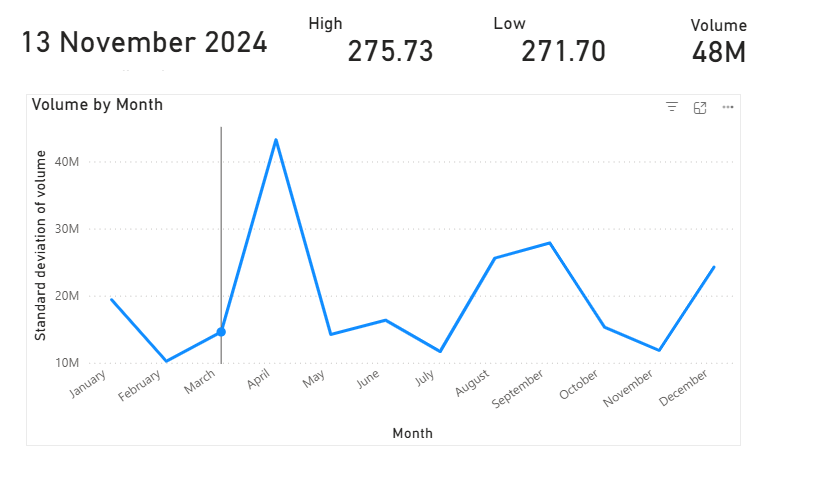

#  End-to-End AWS Finance ETL Pipeline (S3, Glue, Athena, Power BI)

A complete **cloud data engineering project** that ingests stock-market data, stores it in an AWS data lake, transforms it using AWS Glue, queries it with Athena, and visualizes it in Power BI.  
Designed as a **portfolio-ready project** to demonstrate real-world AWS data engineering skills.


##  Project Overview

This project builds a production-style **ETL pipeline** on AWS using:

- **S3** for raw & curated data storage  
- **Glue Crawler** for schema discovery  
- **Glue ETL (Visual Job)** for transformations  
- **Athena** for SQL querying  
- **Power BI** for analytics dashboard  

The pipeline processes **historical stock market price data** (CSV → Parquet), making it queryable, clean, and optimized for analytics.

Later phases will include:
- Live API ingestion (Lambda)
- Technical indicators
- Machine learning forecasting (SageMaker or local)
- Automated scheduling


## 🏗️ Screenshots



Find more in Screenshots folder.

## 🏗️ Architecture

```text
(Local CSV/yfinance)
        │
        ▼
Amazon S3 (raw/finance/)
        │
        ▼
Glue Crawler → Glue Data Catalog (finance_db)
        │
        ▼
Glue ETL Job → Parquet Output
        │
        ▼
Amazon S3 (curated/finance/)
        │
        ▼
Amazon Athena &rarr; Power BI (ODBC)
```

---

##  Features

✔ AWS Data Lake (raw + curated zones)  
✔ Automatic schema discovery using Glue Crawlers  
✔ Visual ETL job transforming CSV → Parquet  
✔ Partition-ready curated layer  
✔ Athena SQL queries enabled  
✔ Power BI connection via Athena ODBC  
✔ Beginner-friendly but production-oriented  
✔ Modular design (API ingestion & ML to be added)

---

## ️ Tech Stack

- **AWS S3**
- **AWS Glue Crawler**
- **AWS Glue ETL (Visual Job)**
- **AWS IAM**
- **AWS Athena**
- **Power BI (ODBC Connector)**
- **Python (yfinance optional)**

---

#  Setup Instructions

##  1. Environment Setup

### 1.1 Create AWS Account  
https://aws.amazon.com/free

### 1.2 Create IAM User  
1. AWS Console &rarr; **IAM → Users → Create user**  
2. Permissions &rarr; **Attach policies directly**:
   - `AmazonS3FullAccess`
   - `AmazonAthenaFullAccess`
3. Create Access Key  
   Download:
   - Access Key ID  
   - Secret Access Key

### 1.3 Install & Configure AWS CLI
```bash
aws configure
```
Values:
- Region: `eu-west-2`
- Keys from previous step

Test:
```bash
aws s3 ls
```

---

##  2. Prepare Sample Data

### Option A — Yahoo Finance  
https://finance.yahoo.com/quote/AAPL/history/

### Option B — Python
```python
import yfinance as yf
data = yf.download("AAPL", start="2024-11-13", end="2025-11-13")
data.to_csv("data/AAPL.csv")
```

---

## 3. Create S3 Bucket

1. AWS Console → **S3 → Create bucket**  
   - Name: `finance-etl-hassan`  
   - Region: `eu-west-2`

2. Create folders:
```
raw/finance/
curated/finance/
athena-output/
```

3. Upload CSV into:
```
raw/finance/
```

---

##  4. Create Glue Data Catalog (Crawler)

1. AWS Console &rarr; **AWS Glue &rarr; Crawlers &rarr; Create Crawler**
2. Name: `finance-raw-crawler`
3. Data source:  
   - S3 path to `raw/finance/`
4. IAM Role:  
   - Create new: `AWSGlueServiceRole-finance`
5. Output:
   - Create database: `finance_db`
6. Schedule:
   - Run on demand

### Run crawler:
AWS Glue → Crawlers → **Run**  
A table will appear under:  
`Glue → Data Catalog → finance_db → Tables`

---

##  5. Create Glue ETL Job (Visual ETL)

1. AWS Console &rarr; **Glue Studio &rarr; ETL Jobs &rarr; Create job**
2. Select **Visual ETL job**

### Source node
- Type: Glue Data Catalog
- Database: `finance_db`
- Table: your CSV table

### Transform node
- Add new column:
  - `ingest_ts = current_timestamp()`

### Target node
- Type: Amazon S3  
- Format: **Parquet**  
- Path:
  ```
  s3://finance-etl-hassan/curated/finance/
  ```

### Run ETL
- Save &rarr; **Run**  
- Check that Parquet files appear in `curated/finance/`

---

##  6. Query Using Amazon Athena

1. AWS Console &rarr; **Athena**
2. Set output location:
```
s3://finance-etl-hassan/athena-output/
```

3. Run:
```sql
SELECT * FROM finance_db.finance LIMIT 10;
```

---

##  7. Connect Power BI to Athena

### Install ODBC Driver  
**Amazon Athena ODBC 1.x**

### Configure ODBC Connection
1. ODBC Data Sources (64-bit)
2. System DSN &rarr; Add &rarr; **Amazon Athena ODBC**
3. Settings:
   - Data source: `Athena-PowerBI`
   - Region: `eu-west-2`
   - Output: `s3://finance-etl-hassan/athena-output/`
   - Catalog: `AwsDataCatalog`
   - Authentication: *IAM Credentials*
     - Username = Access Key ID  
     - Password = Secret Access Key  

Test connection.

### Load in Power BI
1. Power BI &rarr; **Get Data → ODBC**
2. Select `Athena-PowerBI`
3. Load your table

---


#  Next Steps (Planned Enhancements)

- Add **API-based ingestion** using Lambda + EventBridge  
- Add **partitioned storage** by symbol & date  
- Add **technical indicators** (RSI, MACD, MA20/50/200)  
- Add **machine learning forecasting**  
- Deploy ML predictions back into S3 + Athena + Power BI  

---

# Author

  Hassan Eshkiki

